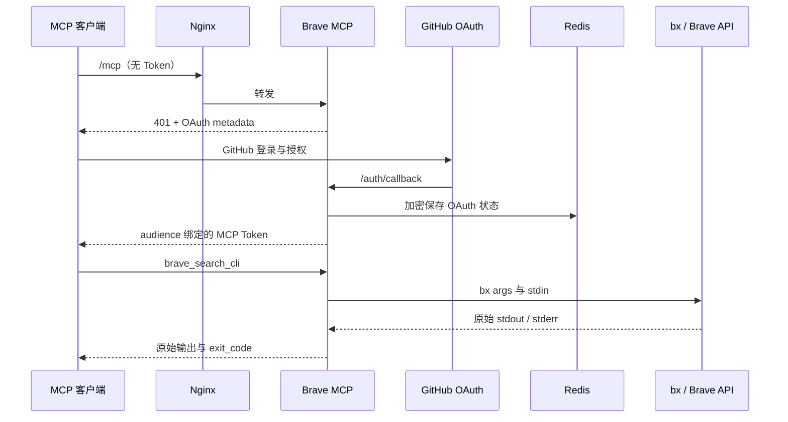

# 配置与运维

## 1 架构



Nginx 代理所有路径。`/mcp`、`/.well-known/*`、`/auth/callback` 和 OAuth 的 DCR/CIMD 路径不能只代理部分 location。

## 2 GitHub OAuth App

在 GitHub Developer Settings 创建 OAuth App：

| 字段 | 值 |
|---|---|
| Application name | Brave Search MCP |
| Homepage URL | `https://{your-domain}` |
| Authorization callback URL | `https://{your-domain}/auth/callback` |

OAuth 仅请求 `read:user`。GitHub 登录成功后，服务仍会对 `BRAVE_MCP_GITHUB_USERS` 执行本地白名单检查。

## 3 环境文件

把 `.env.example` 复制为 `/etc/brave-search-mcp.env`，权限设为 0600。把 `.redis.env.example` 复制为 `/etc/brave-search-mcp.redis.env`，只保留同一份 `BRAVE_MCP_REDIS_PASSWORD`。Redis 容器不接收 GitHub 或 Brave 密钥。两个文件都不进入 Git、镜像或日志。

| 变量 | 用途 | 生成或来源 |
|---|---|---|
| `BRAVE_MCP_BASE_URL` | 公开 HTTPS origin | 部署前替换为实际域名，如 `https://{your-domain}` |
| `BRAVE_MCP_GITHUB_CLIENT_ID` | GitHub OAuth App ID | GitHub 开发者设置 |
| `BRAVE_MCP_GITHUB_CLIENT_SECRET` | GitHub OAuth App Secret | GitHub 开发者设置 |
| `BRAVE_MCP_GITHUB_USERS` | 允许访问的 GitHub login | 逗号分隔，不区分大小写 |
| `BRAVE_MCP_JWT_SIGNING_KEY` | MCP OAuth JWT 签名密钥 | `openssl rand -hex 32` |
| `BRAVE_MCP_STORAGE_KEY` | Redis 中 OAuth 内容的 Fernet 密钥 | `openssl rand -base64 32` |
| `BRAVE_MCP_REDIS_PASSWORD` | 内部 Redis 密码 | `openssl rand -hex 32` |
| `BRAVE_SEARCH_API_KEY` | Brave Search API Key | Brave API Dashboard |

签名密钥或存储密钥轮换会使现有 OAuth 会话失效；先通知用户，再轮换并重启 Compose。Redis 卷保存加密状态，备份时同时保管这两个密钥，否则无法恢复。

## 4 CLI 透传规则

工具名为 `brave_search_cli(args, stdin?)`。`args` 是 `bx` 后的参数列表，不能传入 shell 字符串。

允许 `context`、`answers`、`web`、`news`、`images`、`videos`、`places`、`suggest`、`spellcheck`、`pois`、`descriptions`、`--extra`、`--endpoint`、`--goggles @-` 和 HTTPS Goggles。`answers -` 可通过 `stdin` 传入完整 JSON。

服务拒绝 `config`、`--api-key`、`--config`、`--base-url` 和本地 `--goggles @文件`。这些选项会修改服务器配置、替换服务端凭据或读取容器文件，不属于搜索面透传。

单次调用最多 128 个参数、stdin 1 MiB、stdout/stderr 各 10 MiB，超时为 180 秒。CLI 的非零退出码照常返回；只有 MCP 输入边界、缺少二进制和输出超限会成为 MCP 工具错误。

## 5 Ubuntu 部署与 TLS

部署前设置 `DOMAIN` 环境变量（`export DOMAIN=brave.your-domain.com`），然后执行 `scripts/ubuntu.sh check`。它检查 Ubuntu、架构、DNS、端口、磁盘、内存和所需命令。仅在检查通过后执行 `sudo scripts/ubuntu.sh install` 安装 Docker、Compose、Nginx 和 Certbot。

Compose 只将应用端口绑定到 `127.0.0.1:8766`（容器内仍为 8765），Redis 没有宿主机端口。防火墙只开放 80 和 443。先安装 `deploy/brave-search-mcp.bootstrap.nginx.conf` 并通过 `nginx -t`，再运行 `certbot --nginx -d {your-domain}`；证书签发后替换为 TLS 模板 `deploy/brave-search-mcp.nginx.conf`。

Compose 的 `redis-init` 仅在启动时把命名卷归属设为官方 Redis 镜像的服务 UID/GID，随后退出；Redis 主容器以该非 root UID/GID 运行，保留只读根文件系统和全部 capability drop。

升级 `bx` 时修改 Dockerfile/Compose 的 `BX_VERSION`，重新构建。构建会下载相同 release 的 `.sha256` 并失败关闭，不接受未校验二进制。升级 FastMCP 或 Redis 前先在副本上运行测试和 Compose 验证。

## 6 客户端连接

Codex：

```toml
[mcp_servers.brave-search]
url = "https://{your-domain}/mcp"
```

Claude Code：

```bash
claude mcp add --transport http brave-search https://{your-domain}/mcp
```

ChatGPT、Claude.ai 或 Claude Desktop 使用其远程 Connector 界面添加相同 URL 并完成 GitHub OAuth。不要把远程 HTTP MCP 填入只支持本地 stdio 服务器的配置文件。

WorkBuddy Custom MCP 使用固定回调 URI `workbuddy://workbuddy/mcp/custom-mcp%3Abrave-search/oauth/callback`；服务已将该精确 URI 加入 OAuth 白名单。

## 7 故障处理

| 现象 | 检查项 |
|---|---|
| `/mcp` 返回 401 | 正常的 OAuth 起点；确认 metadata URL 可访问 |
| GitHub 回调 404 | OAuth App callback、`BRAVE_MCP_BASE_URL`、Nginx 全路径代理必须完全一致 |
| 登录后被拒绝 | 检查 `BRAVE_MCP_GITHUB_USERS` 的 GitHub login，而非显示名或邮箱 |
| 重启后要求重新登录 | 检查 Redis 健康、持久卷、JWT 密钥和存储密钥是否改变 |
| bx 返回 3/4/5 | 分别检查 Brave API Key/套餐、限流和网络；MCP 会保留 bx 的 stderr |
| 502 | `docker compose ps`、`docker compose logs mcp`、Nginx error log 和宿主机 8766 监听状态 |
