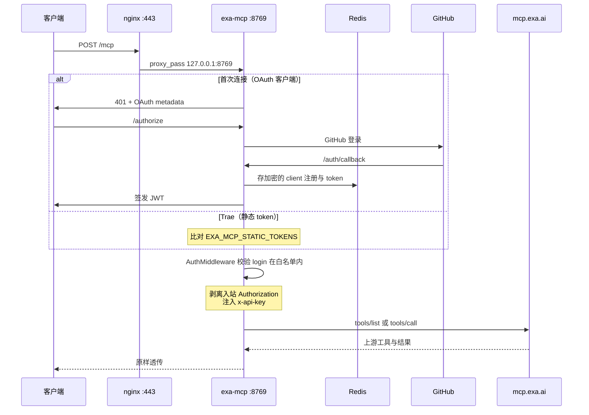

# Exa MCP — 配置与运维

## 1. 架构

本服务是**代理**，不是包装器。这是它与同目录下 brave/firecrawl/lark 三个服务最大的结构差异：那三个都把一个 CLI 二进制包成子进程，而 Exa 没有 CLI，官方 MCP 本身就是远端 HTTP 服务。



工具清单来自上游的实时 `tools/list`，本地不缓存、不重声明。Exa 新增或修改工具时本服务无需改动，`tests/test_server.py::ProxyMirroringTests` 锁定了这个性质。

## 2. GitHub OAuth App

必须为本服务单独建一个 App，不要与其他 MCP 共用（共用会让一个服务的 client 注册满足另一个服务的回调）。

| 字段 | 值 |
|---|---|
| Application name | 任意，例如 `exa-mcp` |
| Homepage URL | `https://{your-domain}` |
| Authorization callback URL | `https://{your-domain}/auth/callback` |

请求的 scope 是 `read:user`，只用来读取登录名做白名单比对。

## 3. 环境变量

`/etc/exa-mcp.env`，权限 `0600`，root 所有。所有必填项缺失都会让容器**启动失败**而非在调用时才报错。

| 变量 | 必填 | 说明 |
|---|---|---|
| `EXA_MCP_BASE_URL` | 是 | 对外 HTTPS origin，如 `https://exa.{your-domain}`。必须是 origin，不能带 path，否则 OAuth metadata 与 JWT audience 会不一致 |
| `EXA_MCP_GITHUB_CLIENT_ID` | 是 | GitHub OAuth App Client ID |
| `EXA_MCP_GITHUB_CLIENT_SECRET` | 是 | GitHub OAuth App Client Secret |
| `EXA_MCP_GITHUB_USERS` | 是 | 逗号分隔的 GitHub 登录名白名单，大小写不敏感。**两条鉴权通道共用这一份名单** |
| `EXA_MCP_JWT_SIGNING_KEY` | 是 | 签发 MCP access token 的密钥，`openssl rand -hex 32`。轮换会让所有客户端重新登录 |
| `EXA_MCP_STORAGE_KEY` | 是 | Redis 中 OAuth 数据的 Fernet 密钥，`openssl rand -base64 32`。轮换会让已存的注册无法解密 |
| `EXA_MCP_REDIS_PASSWORD` | 是 | Redis 密码，必须与 `/etc/exa-mcp.redis.env` 一致 |
| `EXA_API_KEY` | 是 | Exa API Key。只存在服务端，任何客户端都拿不到也传不了 |
| `EXA_MCP_STATIC_TOKENS` | 否 | 静态 bearer token，格式 `login:token`，逗号分隔。见 §4 |
| `EXA_MCP_MAX_CONCURRENCY` | 否 | 并发上游调用上限，默认 8。超限的调用排队而不是直接失败 |
| `EXA_MCP_UPSTREAM_TOOLS` | 否 | 暴露哪些上游工具，逗号分隔。默认四个全开；删掉 `agent_run` 可关闭按量计费的 agent 工具 |
| `EXA_MCP_UPSTREAM_URL` | 否 | 上游端点，不能带 query string。默认 `https://mcp.exa.ai/mcp`，只在指向自建 `exa-mcp-server` 时才改 |
| `EXA_MCP_BOOT_PROBE` | 否 | 设 `0` 跳过启动时的上游/Key 探测 |
| `EXA_MCP_REDIS_HOST` | compose 注入 | 默认 `redis` |

`/etc/exa-mcp.redis.env` 只有一项 `EXA_MCP_REDIS_PASSWORD`，取值与主 env 相同。

## 4. 两条鉴权通道

`MultiAuth` 把 GitHub OAuth 和静态 token 并联。OAuth 一侧仍然独占路由（`MultiAuth.get_routes` 只委托给 `server`），所以加不加静态 token 都不影响 OAuth metadata 和回调端点。

**为什么需要第二条通道**：Trae 的 MCP 客户端不会拉起浏览器、也不刷新 token，[官方明确说明只支持静态 headers 认证](https://forum.trae.cn/t/topic/175024)。纯 OAuth 部署无论配多少 redirect URI 都连不上它。

两条通道的授权语义一致：静态 token 的 claims 里带 `login`，走的是与 OAuth token 完全相同的 `AuthMiddleware` 白名单检查。

约束（全部在启动时校验，不合规直接拒绝启动）：

- token 至少 32 字符
- token 对应的 login 必须同时出现在 `EXA_MCP_GITHUB_USERS` 里 —— 否则该 token 能通过鉴权但工具会被 `AuthMiddleware` 全部过滤掉，表现得像服务坏了而不是配错了
- 同一个 token 不能映射到两个 login

比对使用 `hmac.compare_digest` 且遍历全部条目，错误 token 的耗时与它和真 token 共享多长前缀无关。

静态 token **不会过期**（Trae 无法刷新），因此靠 `scripts/apikey.sh token` 手动轮换：

```bash
sudo scripts/apikey.sh token add your-github-login    # 签发或轮换，token 只打印一次
sudo scripts/apikey.sh token list                     # 掩码列出
sudo scripts/apikey.sh token delete your-github-login # 吊销
```

已支持的 OAuth 回调地址（`ALLOWED_CLIENT_REDIRECT_URIS`）：

| 客户端 | redirect URI |
|---|---|
| ChatGPT / Codex | `https://chatgpt.com/connector/oauth/*`、`https://chatgpt.com/connector_platform_oauth_redirect` |
| Claude Web / Desktop | `https://claude.ai/api/mcp/auth_callback` |
| Grok | `https://grok.com/connectors-oauth-exchange-code/` |
| Cursor | `https://www.cursor.com/agents/mcp/oauth/callback` |
| WorkBuddy | `workbuddy://workbuddy/mcp/custom-mcp%3Aexa/oauth/callback` |
| Claude Code / VS Code / Zed / Gemini CLI | `http://localhost:*`、`http://127.0.0.1:*` |
| Trae | 不适用，走静态 token |

Claude Code 发布的 CIMD 客户端在元数据拉取失败时会走 `_OriginCompatibleGitHubProvider` 的兜底分支注册。

## 5. 代理行为与超时

| 层 | 超时 | 原因 |
|---|---|---|
| 上游 HTTP 读 | 800s（`UPSTREAM_TIMEOUT_SECONDS`） | `agent_run` 把调用挂住直到整个 agent 循环跑完，上游约 750s 才放弃 |
| nginx `proxy_read_timeout` | 900s | 必须大于上面的 800s，否则长跑在 nginx 这层先被截断 |
| 启动探测 | 20s | 只做一次 `initialize` + `tools/list` |

同目录其他服务用的是 300s；本服务特意抬高，是因为 `agent_run` 超时被截断会丢掉客户端续跑所需的 run id。

### 启动探测能验证什么、不能验证什么

启动探测确认的是**上游可达 + 握手成功**，并把实际镜像到的工具清单打进日志。它**不能验证 API Key**：Exa 的 MCP 网关对任何格式正确的 key 都会正常响应 `initialize` 和 `tools/list`，只在真正调用工具时才鉴权（实测：拿一个 `fake-key` 也能取回完整的真实工具定义）。

真正验证 key 要用 `scripts/apikey.sh verify`，它打的是 REST API `https://api.exa.ai/search`。做法是发一个空 body：请求会因参数不合法被拒，所以**不跑搜索、不花 credit**，而 Exa 把 `401 INVALID_API_KEY` 和 `400 INVALID_REQUEST_BODY` 定义为两种不同错误，key 好坏因此可分辨。

脚本不假设 Exa 先校验鉴权还是先校验 body，而是拿「配置的 key」和「一个不可能有效的 key」各探一次再比对：两次结果相同说明 body 校验在前、这个探针看不到鉴权，此时它会明确报 `inconclusive` 而不是猜。判定结果分四种：`valid` / `invalid`（401）/ `no-credits`（402，key 有效但没额度）/ `inconclusive`。

**API Key 不外泄的保证**：FastMCP 的 `ProxyClient` 构造时会强制打开 `forward_incoming_headers`，那会把调用方的 `Authorization`（本服务自己签的 JWT，Exa 无法校验）一并发往上游，Exa 会因此 401 整个请求。`_make_upstream_client()` 在构造后显式关掉它，只让 `x-api-key` 出网。这条不变量由 `test_caller_credentials_are_never_forwarded_upstream` 守住。

每次请求新建一个上游 client，因此每个调用是独立的上游 session，不会串上下文。

## 6. 端口与同机共存

一台机器上四个 MCP 共用一个 nginx，冲突项必须逐个错开：

| 服务 | 宿主端口 | nginx limit_req zone | env 文件 |
|---|---|---|---|
| brave-search-mcp | 8766 | `brave_register` | `/etc/brave-search-mcp.env` |
| firecrawl-mcp | 8767 | `firecrawl_register` | `/etc/firecrawl-mcp.env` |
| lark-cli-mcp | 8768 | `lark_register` | `/etc/lark-mcp.env` |
| **exa-mcp** | **8769** | **`exa_register`** | **`/etc/exa-mcp.env`** |

zone 重名是 `nginx -t` 的硬错误，会让整机所有站点一起下线。每个服务还必须有自己独立的 GitHub OAuth App 和自己的 Redis 卷（compose project 名不同即可）。

## 7. 故障排查

| 现象 | 原因与处理 |
|---|---|
| 工具调用报 401 / `INVALID_API_KEY`，但容器启动正常 | Key 无效或已吊销。启动探测查不出这种情况（见 §5），用 `scripts/apikey.sh verify` 确认，`scripts/apikey.sh set` 换一个 |
| 工具调用报 402 / `NO_MORE_CREDITS` | Key 有效但账户额度用尽，去 dashboard.exa.ai 充值。重试无用 |
| 容器启动失败，日志 `upstream refused the handshake` | 上游连握手都拒了。先跑 `scripts/apikey.sh verify` |
| 容器启动失败，`missing required environment variable: X` | `/etc/exa-mcp.env` 缺项。注意 env 文件只在容器**创建**时读取，改完要 `docker compose up -d --force-recreate mcp`，`restart` 不生效 |
| 启动日志有 `could not reach upstream Exa MCP at boot` 但服务在跑 | 启动时网络抖动，Key 本身没问题，恢复后自动可用。刻意不让它 crash-loop |
| `tools/list` 是空的，但登录成功了 | 登录名不在 `EXA_MCP_GITHUB_USERS` 里。`AuthMiddleware` 的设计是过滤掉工具而非报错，所以表现为空列表 |
| Trae 报 `Unauthorized` | Trae 不会走 OAuth。必须用 `scripts/apikey.sh token add` 签静态 token 并填进 `headers` |
| 静态 token 配了但容器起不来 | token 短于 32 字符，或对应 login 不在 `EXA_MCP_GITHUB_USERS` 里。日志会指明是哪一条 |
| `agent_run` 长跑被切断 | 检查 nginx 的 `proxy_read_timeout` 是否仍是 900s。上游超过约 750s 会返回 `status: "running"` 和 run id，用 `runId` 再调一次 `agent_run` 续等 |
| 工具调用报 `server is at capacity` | 并发已满，**本次什么都没执行**，几秒后重试即可。要提高上限请同时上调 `EXA_MCP_MAX_CONCURRENCY` 和 compose 里的 `mem_limit`/`pids_limit` |
| `/register` 返回 429 | nginx 对 OAuth 动态注册限流 10r/m。正常客户端每次安装只注册一次，触发说明有异常重试 |
| 回调 404 | nginx 必须代理**所有路径**，不能只配 `/mcp`。`/auth/callback`、`/register`、`/.well-known/*` 都要能通 |
| 换了 `EXA_MCP_STORAGE_KEY` 后所有客户端要重新登录 | 预期行为，旧的加密注册无法解密。`EXA_MCP_JWT_SIGNING_KEY` 同理 |

## 8. 与官方 MCP 的差异

除以下几点外，工具行为与 <https://exa.ai/docs/reference/exa-mcp> 完全一致：

- API Key 在服务端，客户端不传 key，也不会撞匿名 tier 限流
- 入站需通过 GitHub OAuth 或静态 token，且登录名要在白名单内
- 并发上游调用有上限，超限时排队，极端情况报 `server is at capacity`
- 只暴露 `EXA_MCP_UPSTREAM_TOOLS` 选中的工具（默认四个全开）
