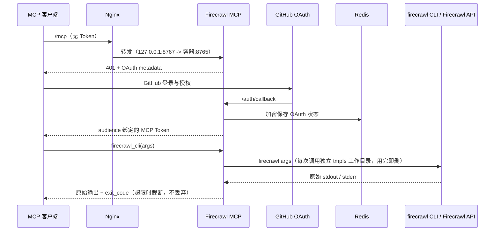

# 配置与运维

## 1 架构



Nginx 代理所有路径。`/mcp`、`/.well-known/*`、`/auth/callback` 和 OAuth 的 DCR/CIMD 路径不能只代理部分 location。

## 2 GitHub OAuth App

在 GitHub Developer Settings 创建**独立**的 OAuth App（不要复用同一台服务器上其他 MCP 的 App，一个 OAuth App 只能配一个 callback）：

| 字段 | 值 |
|---|---|
| Application name | Firecrawl CLI MCP |
| Homepage URL | `https://firecrawl.nexuszone.link` |
| Authorization callback URL | `https://firecrawl.nexuszone.link/auth/callback` |

OAuth 仅请求 `read:user`。GitHub 登录成功后，服务仍会对 `FIRECRAWL_MCP_GITHUB_USERS` 执行本地白名单检查，未在白名单里的账号即使登录成功也看不到任何工具。

## 3 环境文件

把 `.env.example` 复制为 `/etc/firecrawl-mcp.env`，权限 0600。把 `.redis.env.example` 复制为 `/etc/firecrawl-mcp.redis.env`，只保留同一份 `FIRECRAWL_MCP_REDIS_PASSWORD`。Redis 容器不接收 GitHub 或 Firecrawl 密钥。两个文件都不进入 Git、镜像或日志。

| 变量 | 用途 | 生成或来源 | 改动后果 |
|---|---|---|---|
| `FIRECRAWL_MCP_BASE_URL` | 公开 HTTPS origin | 固定为 `https://firecrawl.nexuszone.link` | 改了要同步 nginx/OAuth App |
| `FIRECRAWL_MCP_GITHUB_CLIENT_ID` / `_SECRET` | GitHub OAuth App | GitHub 开发者设置 | 换 App 后所有会话失效 |
| `FIRECRAWL_MCP_GITHUB_USERS` | 允许访问的 GitHub login，逗号分隔，不区分大小写 | 自定 | 增删即时生效（下次请求） |
| `FIRECRAWL_MCP_JWT_SIGNING_KEY` | MCP OAuth JWT 签名密钥 | `openssl rand -hex 32` | 轮换后**所有会话失效**，需重新授权 |
| `FIRECRAWL_MCP_STORAGE_KEY` | Redis 中 OAuth 内容的 Fernet 密钥 | `openssl rand -base64 32` | 轮换后**所有会话失效**；备份 Redis 卷时必须同时备份这个密钥，否则无法解密恢复 |
| `FIRECRAWL_MCP_REDIS_PASSWORD` | 内部 Redis 密码，两个 env 文件都要有且必须相同 | `openssl rand -hex 32` | 两边不一致会导致 MCP 容器连不上 Redis |
| `FIRECRAWL_API_KEY` | Firecrawl API Key | [firecrawl.dev API Keys](https://www.firecrawl.dev/app/api-keys) | 缺失或失效时**每次工具调用**都会报明确错误，不会静默降级到 keyless 免费额度 |
| `FIRECRAWL_MCP_UPDATE_CHECK` | 可选，设为 `0` 关闭后台版本检测 | 默认开启 | 关闭后 `update_available` 字段永不出现 |

日常改 Key 用 `scripts/apikey.sh`，不要手改这个文件（见 §8）。

## 4 命令白名单与被拦参数

工具名 `firecrawl_cli(args, stdin?)`。`args` 是 `firecrawl` 后的参数数组，不能传 shell 字符串。

**允许的命令**：`search`、`scrape`、`map`、`crawl`、`agent`、`research`（含其 `search-papers`/`inspect-paper`/`related-papers`/`read-paper`/`search-github` 子命令）、`credit-usage`；不带子命令时只允许 `--help`/`--version`/`--status`。

**拒绝的命令及理由**：

| 命令 | 理由 |
|---|---|
| `monitor` | 建持久定时任务 + webhook/邮件通知，本 MCP 不开放标准基础设施 |
| `feedback` / `search-feedback` | 回传使用数据到 Firecrawl；服务端也已设置 `FIRECRAWL_NO_SEARCH_FEEDBACK=1`/`FIRECRAWL_NO_ENDPOINT_FEEDBACK=1` |
| `browser` / `launch` / `interact` | 在共享服务器上开持久远程浏览器会话 |
| `download` / `experimental` / `x` | 写本地磁盘 |
| `parse` | 只接受服务器本地文件路径 |
| `config` / `view-config` / `login` / `logout` | 管理本地凭据；服务端已持有 API Key |
| `init` / `setup` / `make` / `env` / `doctor` | 只适用于本地机器 |

**拒绝的参数**（`--flag value` 与 `--flag=value` 两种写法都拦）：`-k/--api-key`、`--api-url`（服务端持凭据）；`-o/--output`（结果走响应的 `stdout` 字段，没有共享文件系统）；`--schema-file`/`--actions-file`/`--scrape-options-file`（改用内联 JSON）；`--webhook`（不开放外发）；`--profile`/`--no-save-changes`（不留持久浏览器登录态）。

**限额**：单次调用最多 128 个参数、每参数 16KiB、stdin 1MiB、stdout/stderr 各 10MiB（超限截断并返回 `truncated: true` + `original_bytes`，不丢弃）、超时 180 秒。CLI 只有 0/1 两个退出码，可操作信息在 stderr 文本里，不在 exit_code 里。

每次调用在独立的 tmpfs 临时目录（`HOME`/`TMPDIR`/`cwd` 均指向它）中运行，调用结束（正常、非零退出或超时）后立即删除，不残留任何 `.firecrawl/` 或凭据缓存文件。

## 5 CLI 版本检测

服务端每 6 小时后台异步查一次 GitHub Releases API（无认证，60 次/小时/IP 配额），发现新版本时给该次工具响应加一个 `update_available` 字段，不阻塞、不影响调用结果；查询失败静默重试，不抛出。CLI 自带的更新检查（会打 npm registry、写 `~/.firecrawl`、往 stderr 打通知）已通过 `FIRECRAWL_NO_UPDATE_CHECK=1` 关闭。设 `FIRECRAWL_MCP_UPDATE_CHECK=0` 可整体关闭本服务端的检测（离线部署）。

看到 `update_available` 后用 `scripts/update-cli.sh` 升级，见 §7。

## 6 Ubuntu 部署与 TLS

先执行 `scripts/ubuntu.sh check`。它检查 Ubuntu、架构、DNS、80/443/8767 端口、磁盘、内存和所需命令。仅在检查通过后执行 `sudo scripts/ubuntu.sh install` 安装 Docker、Compose、Nginx 和 Certbot。

Compose 只将应用端口绑定到 `127.0.0.1:8767`（容器内仍为 8765），Redis 没有宿主机端口。防火墙只开放 80 和 443。先安装 `deploy/firecrawl-mcp.bootstrap.nginx.conf` 并通过 `nginx -t`，再运行 `certbot --nginx -d firecrawl.nexuszone.link`；证书签发后替换为 TLS 模板 `deploy/firecrawl-mcp.nginx.conf`。

Compose 的 `redis-init` 仅在启动时把命名卷归属设为官方 Redis 镜像的服务 UID/GID，随后退出；Redis 主容器以该非 root UID/GID 运行，保留只读根文件系统和全部 capability drop。MCP 容器同样 `read_only: true`，`/tmp` 是 128MiB 的 `noexec,nosuid` tmpfs（比 8766 端口上那套 brave-search-mcp 的 32MiB 大，用来容纳 crawl 的中间数据）。

## 7 升级 firecrawl CLI

```bash
scripts/update-cli.sh --dry-run    # 只报告当前/最新版本，不改任何东西
scripts/update-cli.sh              # 升级到最新版本
scripts/update-cli.sh 1.19.28      # 升级到指定版本
```

流程：确认目标 release 的三个资产（两个架构的 tarball + `checksums.txt`）都存在 → 改 `Dockerfile` 的 `ARG FIRECRAWL_VERSION`（sha256 校验在构建内完成，校验不过构建直接失败）→ `docker compose build && up -d --force-recreate` → 轮询容器 healthy → 冒烟 `firecrawl --version` 与一次真实 `search`。构建、healthcheck 或版本冒烟失败会自动还原 `Dockerfile` 并重建回滚，退出码非零；只有最后的 `search` 冒烟失败是警告，不回滚（可能只是这次查询本身的问题）。不配 cron/systemd timer——升级由你在看到工具响应里的 `update_available` 后手动触发。

## 8 管理 Firecrawl API Key

```bash
scripts/apikey.sh show      # 掩码查看当前 key，不泄露完整值
scripts/apikey.sh set       # 交互式输入新 key（隐藏，不进 shell history），校验后写入并重建容器
scripts/apikey.sh verify    # 只校验当前生效的 key，不改任何东西
scripts/apikey.sh delete    # 删除 key；此后每次工具调用都会报明确的缺失错误
```

`set`/`delete` 之后必须 `docker compose up -d --force-recreate`（脚本已自动做）——`env_file` 只在容器创建时读取，`docker compose restart` 不会重新加载。

## 9 客户端连接

Codex：

```toml
[mcp_servers.firecrawl]
url = "https://firecrawl.nexuszone.link/mcp"
```

Claude Code：

```bash
claude mcp add --transport http firecrawl https://firecrawl.nexuszone.link/mcp
```

ChatGPT、Claude.ai 或 Claude Desktop 使用其远程 Connector 界面添加相同 URL 并完成 GitHub OAuth。不要把远程 HTTP MCP 填入只支持本地 stdio 服务器的配置文件。给 agent 的传参规则和边界见 [AGENTS.md](AGENTS.md)。

## 10 故障处理

| 现象 | 检查项 |
|---|---|
| `/mcp` 返回 401 | 正常的 OAuth 起点；确认 metadata URL 可访问 |
| GitHub 回调 404 | OAuth App callback、`FIRECRAWL_MCP_BASE_URL`、Nginx 全路径代理必须完全一致 |
| 登录后被拒绝 | 检查 `FIRECRAWL_MCP_GITHUB_USERS` 的 GitHub login，而非显示名或邮箱 |
| 重启后要求重新登录 | 检查 Redis 健康、持久卷、`FIRECRAWL_MCP_JWT_SIGNING_KEY`/`FIRECRAWL_MCP_STORAGE_KEY` 是否改变 |
| `missing required environment variable: FIRECRAWL_API_KEY` | 用 `scripts/apikey.sh show` 确认 key 是否被删除或 env 文件没挂对 |
| stderr 出现 401/403 或 "unauthorized" | 服务端 Key 无效或权限不足，`scripts/apikey.sh verify` 排查 |
| stderr 出现 402 或 "credit" | 账号额度用尽，去 Firecrawl 控制台充值/等待重置 |
| stderr 出现 429 或 "rate limit" | 触发限流，客户端退避重试 |
| 502 | `docker compose ps`、`docker compose logs mcp`、Nginx error log 和宿主机 8767 监听状态 |

## 11 与同机其他 MCP（如 brave-search-mcp）共存的检查

这台服务器如果已经跑着别的同架构 MCP（例如占用宿主 8766 端口的 brave-search-mcp），部署完成后逐项确认：

| 项 | 检查方式 | 期望 |
|---|---|---|
| 宿主端口 | `ss -ltnp \| grep 876` | 各 MCP 端口不同（本服务 8767），无第三者占用 |
| compose 项目 | `docker compose ls` | 目录名不同 → 独立 project，互不干扰 |
| 容器/网络/卷 | `docker ps -a`、`docker volume ls`、`docker network ls` | volume 名带各自项目前缀，未共用；default network 互不连通 |
| nginx | `nginx -t`、`ls /etc/nginx/sites-enabled/` | 各 server_name 独立 block，同一 80/443 监听不冲突 |
| 证书 | `certbot certificates` | 每个域名一张独立证书，续期钩子都在 |
| env 文件 | `ls -l /etc/*mcp*.env` | 各自 600，变量前缀不同（`FIRECRAWL_MCP_*` vs 其他）天然隔离 |
| 内存 | `free -m` 对比各 `mem_limit` 之和 | 有余量；不足则下调本服务的 `mem_limit`（compose.yaml 里 mcp/redis 各 512m/256m） |
| GitHub OAuth App | GitHub 设置页 | 每个 MCP 独立 App，callback 各自一条，不共用 |
| 客户端命名 | `claude mcp list` | 各 MCP 条目、工具名（如 `firecrawl_cli` 与 `brave_search_cli`）不撞 |

全部检查完后，回归测试一次其他 MCP 的工具调用，确认没被本次部署影响。
