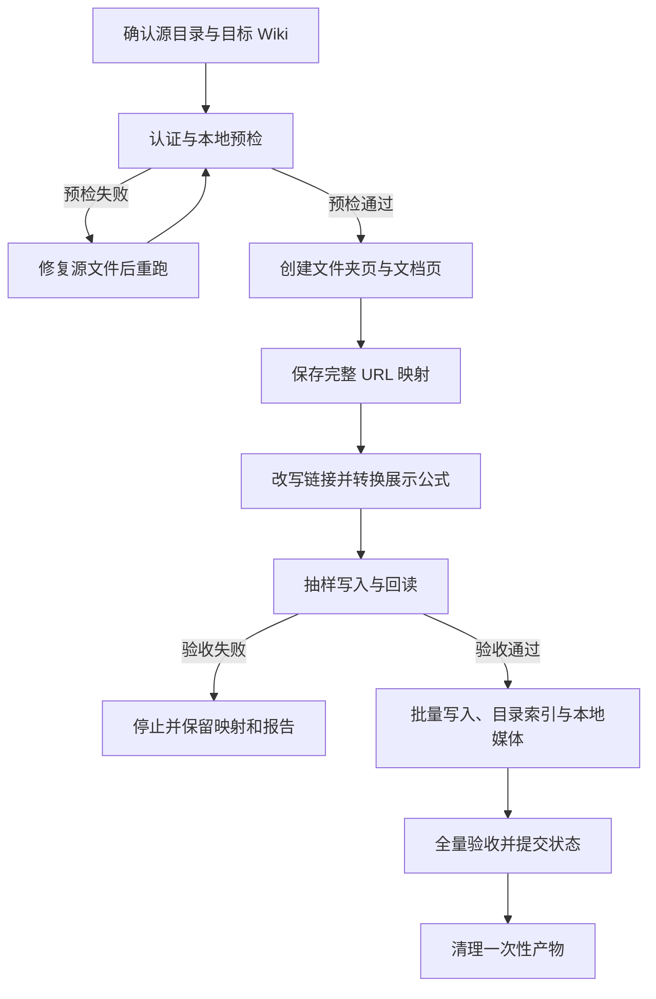

# 本地 Markdown 目录发布

仅当用户要求发布、迁移、增量同步或反向拉取本地 Markdown 目录时读取本文件。日常飞书文档阅读和编辑使用 `SKILL.md` 的远程 MCP 工作流，不运行这里的本地脚本。

本地转换只需要 Python 和本目录下的 `scripts/`；飞书读取和写入统一调用已连接的远程 Lark-Markdown MCP，不要求本机安装 `lark-cli`。

## 标准 SOP

适用于首次把一个本地 Markdown 目录发布到新建或既有飞书 Wiki。增量发布与反向拉取分别按后文对应章节执行。



1. 确认本地源目录、发布目标和是否允许创建新页面；目标缺失时只预检。
2. 调用 `check_lark_cli`；仅在 `user_status=ready` 且 `verified=true` 时继续。运行 `prepare_publish.py`，处理 `errors` 和重复标题。
3. 先为每个本地文件夹创建 Wiki Docx 页面，再创建全部 Markdown 页面；每成功一个页面立即写入 `url-map.json`。不要以正文中的链接推断页面创建顺序。
4. 映射完整后重新运行 `prepare_publish.py --url-map`，将本地文档链接替换为远端 URL；再运行 `center_display_math.py`。源 Markdown 保持不变。
5. 选取 1 个含链接、表格、公式或图片的页面，使用 `batch_push` 覆盖写入并回读 Markdown 与 XML。`partial_success` 必须靠回读判定，不能直接视为成功。
6. 抽样通过后批量写入其余正文，每批最多 100 项；成功且非 `partial_success` 的项目不回读全文。在正文 URL 全部确定后生成并写入每个文件夹的索引页。
7. 对本地媒体保留唯一标记，调用 `insert_media` 在标记位置插入，再用 `point_update` 删除标记。媒体失败时停止该项并保留标记，不得把文件附加到文末。
8. 用本地 manifest、URL 映射和 MCP 写入结果验证文档数、目录索引链接与跨文档 URL；只对抽样页及异常项读取公式 XML 和媒体块。写入结果中的 revision 完整后运行 `commit_publish_state.py`。最后运行 `cleanup_workspace.py`，只保留状态、URL 映射和报告。

恢复规则：创建阶段失败时保留 `url-map.json`，恢复时仅创建未映射页面；本地删除默认不删除远端页面；检测到 `conflicts`、`new_remote` 或 `missing_remote` 时停止，等待用户决定。

## 输入与边界

需要：本地目录、目标 Wiki 节点 token（或目标文件夹 token）、是否允许创建新文档。未提供目标 token 时只做预检，不执行写入。

不修改源 Markdown。所有转换写入隐藏工作目录 `.lark_publish/`；发布状态写入 `.lark_publish/state.json`，并将 `.lark_publish/` 加入 `.gitignore`。每次运行结束（成功或失败）都删除一次性产物，只保留 `state.json`、`url-map.json` 和 `report.json`。

`prepare_publish.py` 强制工作目录名为 `.lark_publish`，不同发布根（例如先发布 `knowledge-base` 的 AI/ML 子树，再单独发布 `knowledge-base/math`）的 state 会占用同一目录而冲突。多批次发布时，把上一批的 `.lark_publish/` 整体改名为 `.lark_publish_<批次>_state/`（加入 `.gitignore`）再开始下一批；后续对某批做增量发布前，把对应备份目录换回 `.lark_publish/`。`state.json` 的文档键应相对于该批的发布根，不要混用不同发布根的键空间。

跨文档引用可能形成环，不能按拓扑序逐篇导入。固定采用两阶段：**先为全部 Markdown 和本地文件夹创建空 Docx 并取得 URL，再回写正文**。这是唯一能保证循环引用正常的顺序。

本地文件夹不创建飞书“文件夹”节点：每个文件夹对应一个 Docx 页面。该页面列出该文件夹内（含子文件夹）的所有本地 Markdown 文档，并将链接改写为其飞书 URL；所有 Markdown 页面和文件夹页面都在同一 Wiki 层级中建立父子关系。

飞书文档 URL 不提供可由 Markdown 稳定构造的标题锚点；`file.md#标题` 转换成目标文档 URL，保留链接文字，并在报告中列出被降级的章节跳转。

## 增量发布

首次成功发布后，将每个文档的源文件 SHA-256、飞书 URL、doc token 与 revision 写入 `state.json`。后续先生成最新 `manifest.json`，再计算最小写入集合：

```bash
python3 scripts/plan_incremental.py \
  --manifest .lark_publish/manifest.json --state .lark_publish/state.json \
  --out .lark_publish/incremental-plan.json
```

- 只把 `write_set` 交给 MCP `batch_push`；未变更文件不读取、不覆盖。
- 新增文档先创建并补充 URL 映射；其已有引用方也进入 `write_set`，以写入新 URL。
- 本地删除只列在 `deleted_local`，默认不删除远端节点。删除远端必须单独取得用户确认。

## 反向拉取

反向拉取规划不是推送的镜像操作：飞书 Docx 不保存原始本地路径、Wiki 风格链接语法、图片原文件名和部分排版元数据。只对本 skill 创建并已记录在 `state.json` 的受管文档生成安全计划；其他远端节点先列为 `new_remote`，不自动写入本地。

1. 用 MCP `batch_pull` 读取受管文档的 Markdown 与 `revision_id`，将结果写入 `.lark_publish/remote/` 与 `remote-index.json`。
2. 运行冲突规划：

```bash
python3 scripts/plan_pull.py \
  --state .lark_publish/state.json --remote-index .lark_publish/remote-index.json \
  --local-root <source-directory> --out .lark_publish/pull-plan.json
```

3. 仅将 `pull` 项转换到临时目录，再生成 diff；`conflicts`、`new_remote`、`missing_remote` 一律停下并报告。未经用户确认，绝不覆盖本地文件或删除本地文件。
4. 拉取转换时，把 `url-map.json` 中的受管飞书 URL 反写为相对 `.md` 链接；居中 `<latex>` 段落反写为 `$$...$$`。图片和附件仅在 `state.json` 有原始本地路径与远端资源 token 对应关系时下载并替换，否则保留远端链接并报告。

## 1 预检

先调用 MCP `check_lark_cli`。工具缺失、连接失败或 `verified=false` 时停止，不创建中间文件；返回 `update_notice` 时只提示可手动升级，不影响发布。

```bash
python3 scripts/prepare_publish.py \
  <source-directory> --out .lark_publish
```

检查 `.lark_publish/manifest.json`：

- `errors` 必须为空；控制字符、无法解析的本地图片或链接先修复源文件后重跑。
- 检查 `documents`、`edges`、`images`、`whiteboards`；记录入边/出边和所有带 `fragment` 的链接。
- 报告重复标题；飞书同一节点下标题重复时先要求用户改名或确认。

## 2 创建文档并生成 URL 映射

目标为 Wiki 时使用 `create_wiki_node`：根页面传 `space_id`，子页面传 `parent_node_token`。目标为普通 Drive 文件夹时使用 `create_document` 并传文件夹 token。

先按本地目录树创建每个文件夹的空白 Wiki Docx 节点，再按 `manifest.json` 的 `documents` 顺序创建 Markdown 的 Wiki Docx 节点；立即将每个返回的文档 URL 写入 `.lark_publish/url-map.json`。Markdown 置于其父文件夹节点下，子文件夹节点置于父文件夹节点下。

```json
{
  "relative/path.md": "https://example.feishu.cn/docx/docx_token"
}
```

文件夹节点的 token 不要放进 `url-map.json`：`prepare_publish.py --url-map` 要求键集合**严格等于** `manifest.json` 的 source Markdown 相对路径，多出文件夹键会以 `extra_url_map` 报错退出码 2 且不落盘改写稿。文件夹节点 token 单独存入 `.lark_publish/nodes.json`（键为 `{label}` 或 `{label}/{相对路径}`），供 `build_folder_indexes.py` 使用。

发布到 Wiki 时使用 MCP `create_wiki_node`，根节点传 `space_id`、子节点传 `parent_node_token`；发布到 Drive 文件夹时使用 `create_document` 并传 `parent_token`。每次成功后立即记录返回 URL；不要等整批结束后才保存映射。

创建前先 dry-run；创建成功后才能继续。失败时停止，保留已写入的 `url-map.json` 以便恢复，不要重建已存在的文档。

## 3 生成已改写正文

```bash
python3 scripts/prepare_publish.py \
  <source-directory> --out .lark_publish --url-map .lark_publish/url-map.json
```

该步骤将相对 `.md` 链接改为映射中的飞书 URL。随后 `center_display_math.py` 做四项确定性预处理（均跳过代码块）：

- 独立 `$$...$$` 转为居中的飞书公式段落 `<p align="center"><latex>...</latex></p>`；行内 `$...$` 保持不变。
- `\(...\)` LaTeX 行内公式转为 `$...$`。飞书只渲染 `$...$`，`\(...\)` 会被降级为字面括号文本（如 `(\alpha)`），必须在此步改写。
- 成对 `**...**` 粗体转为 `<b>...</b>`。飞书 Markdown 粗体解析器对 `**词**（` 等 CJK 标点紧邻模式会错位边界，`<b>` 是飞书原生标签，无此问题。
- GFM 脚注 `[^id]` 与定义 `[^id]: 来源` 分别转为 `[id]` 和飞书引用块 `> [id] 来源`；转换由脚本完成，不交给 AI 重写。

```bash
python3 scripts/center_display_math.py \
  .lark_publish/markdown .lark_publish/markdown-rendered
```

只上传 `.lark_publish/markdown-rendered/`，绝不覆盖本地源文件。

## 4 写入正文、文件夹索引与图片

将渲染稿读入后交给 MCP `batch_push`，使用 `mode=overwrite`、`doc_format=markdown` 和默认 `concurrency=4`。单批不超过 100 项；仅父子节点或同一文档的顺序操作不可并发。服务端限流时逐步降至 `concurrency=1`。

先写入并读取 1 个含表格/公式/链接的抽样文档验证格式，再写入其余文档。其余成功且非 `partial_success` 的项目不调用 `batch_pull`；仅回读失败、部分成功或格式敏感项。

在全部 Markdown 页面 URL 已确定后，为每个文件夹生成索引页。索引页只列该文件夹的**直接子文档**和**直接子文件夹**（链接到子文件夹节点），不递归平铺全部后代文档——否则父子页内容重复。链接文字用文档名（不含目录前缀）。

`nodes.json` 是文件夹节点 token 或 `{"url": ...}` 对象，键为 `{label}` 或 `{label}/{相对路径}`。`docs.json` 的键统一使用相对发布根目录的 Markdown 路径，值为 `{"url": ...}` 或 `{"url": ..., "summary": "一句话简介"}`（带 `summary` 时索引页生成 `链接：summary` 格式）。两者需在运行前手动构造，`prepare_publish.py` 不生成它们。

```bash
python3 scripts/build_folder_indexes.py \
  --root <source-directory> --label <root-label> \
  --nodes .lark_publish/nodes.json --docs .lark_publish/docs.json \
  --out .lark_publish/folder-indexes
```

将每个 `.lark_publish/folder-indexes/*.md` 覆盖写入其对应文件夹 Docx。页面已存在时只重写索引页，绝不重建叶子 Markdown 页面，避免产生重复节点。

本地图片不能直接作为 Markdown 相对路径导入。对每个 `manifest.images` 条目：先在正文中保留唯一文本标记，读取文件并用 MCP `insert_media` 原位插入，再用 `point_update` 删除标记。不得把图片附加到文末；外部 `https` 图片可保留 Markdown 图片链接。

## 5 验收

以本地 manifest、URL 映射和 MCP 返回结果确认；远端正文只抽样读取，并对失败、部分成功和格式敏感项读取：

- 远端文档数等于 `manifest.documents` 数量。
- 每个本地文件夹均有一个飞书 Docx 页面；其索引中的每个链接均指向已创建的 Markdown 页面。
- 抽样 XML 验证原 `$$...$$` 块已变为 `<p align="center"><latex>...</latex></p>`；包含公式或本次转换失败的文档必须读取。
- 用渲染稿和 `manifest.edges` 验证每条链接目标属于 `url-map.json`；仅抽样检查远端 Markdown，或在写入异常时回读。
- 用 `insert_media` 成功结果确认每个本地图片已处理；标记不唯一、失败或用户要求位置验收时读取目标文档。
- 从创建/写入 MCP 返回值写入每篇的 URL、doc token 和 `revision_id` 到 `.lark_publish/remote-index.json`；仅在返回字段缺失时调用 `batch_pull` 补齐。

验收通过后原子提交状态：

```bash
python3 scripts/commit_publish_state.py --workdir .lark_publish
```

该命令只有在 manifest、URL 映射和远端 revision 完整一致时才更新 `state.json`；失败只写 `report.json`，不覆盖上次成功状态。

若返回 `partial_success`，必须 fetch 并执行本节验收；验收通过才可继续。遇到权限、scope、限流或验收失败时停止并报告具体文件；不要静默跳过。

### 5.1 能力矩阵

发布目标是完整保留当前飞书文档转换层支持的 Markdown，并对本地 Wiki 风格语法做确定性转换；不要声称支持未定义的“所有 Markdown 方言”。

| 输入能力 | 处理方式 |
|-|-|
| 段落、H1-H6、粗体、斜体、删除线、行内代码、代码块、引用、分隔线、链接、有序/无序及嵌套列表、GFM 表格、行内公式 | 原样交给 MCP `batch_push` 的 Markdown 模式；内容开头唯一 H1 会成为飞书文档标题 |
| HTTP(S) 图片 | 保留 Markdown 图片 URL，由飞书下载 |
| 本地图片、Wiki 风格 `![[image]]` | 标记后用 MCP `insert_media` 原位插入 |
| 相对 `.md` 链接、循环引用 | 两阶段 URL 映射后改写；标题锚点降级为文档 URL |
| `$$...$$` 展示公式 | 转换为居中的 `<latex>` 段落；不得转换代码块中的字面量 |
| 下划线、待办、高亮框、分栏、文字色/背景色、书签、@人/@文档 | 在 Markdown 中嵌入 `lark-doc-xml.md` 对应标签；需要 token/ID 的组件只有输入真实标识后才写入 |
| URL 预览、按钮、提醒 | 不同 CLI/飞书版本可能降级为文本或丢弃；以实时回读为准，在结果中报告降级，不宣称原生块保真 |
| 画板 | 简单图直接嵌入 `<whiteboard type="mermaid">`；拿到 `block_token` 后用 MCP `whiteboard_query` / `whiteboard_update` 读写 |
| Sheet、任务、群聊卡片、Wiki 子页面列表 | 使用 XML 资源块并要求真实 token/ID；不伪造测试数据 |
| Bitable、同步块、OKR 等 CLI 标为不可创建的资源块 | 只保留或移动已有块，不从 Markdown 新建 |

**有序列表内嵌展示公式的编号降级**：飞书把有序列表项之间的独立 `$$...$$` 段落当作列表打断符，后续列表项会被自动重新从 1 编号。`center_display_math.py` 无法规避（公式已在列表项外）。源文件层面规避：把列表项内的展示公式改写为行内 `$...$`，使公式留在列表项内部；或把该步骤的公式拆成独立段落、列表只列非公式步骤。

抽样或格式敏感项验收时同时 fetch Markdown 与 XML：Markdown 回读检查文本语义，XML 回读检查飞书原生块类型。画板还要用 `whiteboard +query --output_as code` 验证可读，并至少执行一次更新后再次查询。

## 6 清理

验收或异常处理结束后都运行：

```bash
python3 scripts/cleanup_workspace.py \
  --workdir .lark_publish
```

该命令只保留增量发布和恢复所需的 `state.json`、`url-map.json`、`report.json`；其余 manifest、渲染稿、拉取副本、索引和计划文件全部删除。不得删除源 Markdown。
